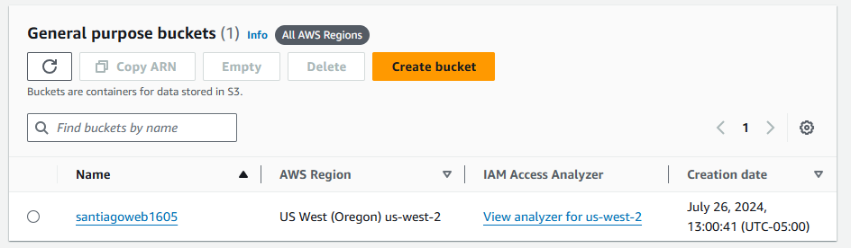
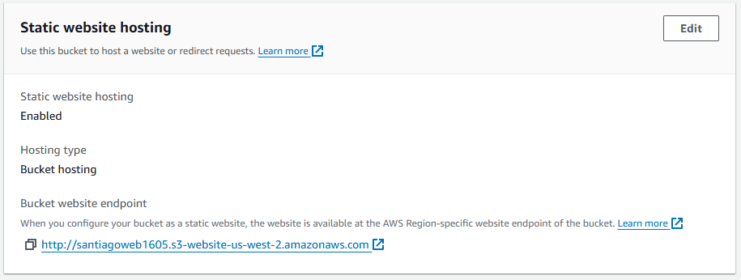
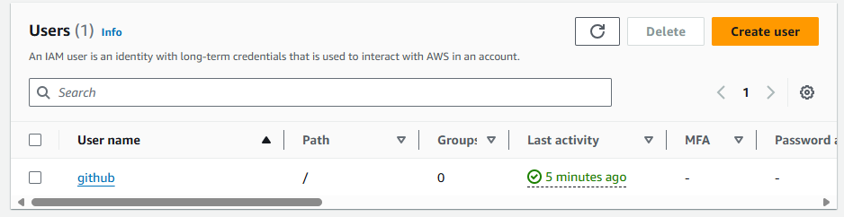
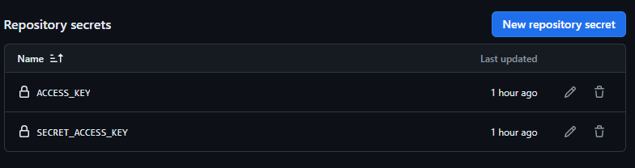
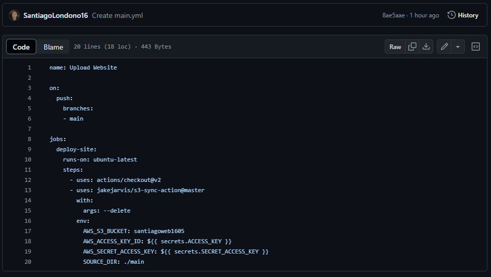

<h1>AWS Fundamentals - Final Task</h1>
<h3>Step 1: Both the repository and the bucket were created.</h3>

The bucket name is: santiagoweb1605

<h3>Step 2: We enable the option to hosting static websites in the S3 bucket</h3>

<h3>Step 3: To give Github permission to deploy the code to Amazon S3, an IAM policy was created</h3>

The IAM user is called: "github", it gives full permissions to Amazon S3, additionally the access keys were created to use the policy in Github

<h3>Step 4: We take the access keys and add them to Github in the secrets section</h3>

<h3>Step 5: We create the Github Actions workflow to deploy the code stored in the main folder</h3>

